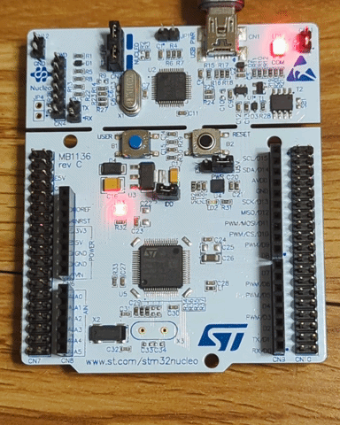

# Embedded RTOS

A work-in-progress bare-metal embedded RTOS project for embedded systems, initially targeting ARM Cortex-M microcontrollers.

This project is being built from the ground up to explore core RTOS concepts including thread management, context switching, scheduling, synchronization primitives, timing services, inter-thread communication, and real-time hardware demos.

The initial implementation targets the Nucleo-F411RE development board, which uses the STM32F411RE Cortex-M4 microcontroller.

---

## Current Milestone: UART Echo

The current verified milestone is polling USART2 transmit/receive bring-up on the Nucleo-F411RE through the ST-LINK virtual COM port.

Implemented and verified:

- Custom startup path from reset to `main()`
- Linker script for STM32F411RE Flash/RAM layout
- GPIOA peripheral clock enable through RCC
- PA5/LD2 GPIO blink using direct register access
- USART2 transmit over PA2 through ST-LINK VCP
- USART2 receive over PA3 through ST-LINK VCP
- Polling `TXE` before transmit writes
- Polling `RXNE` before receive reads
- Basic carriage-return handling for clean terminal output

### GPIO Blink Demo



### UART Echo Demo


---

## Current Project Layout

```text
embedded-rtos/
├── Makefile
├── README.md
├── LICENSE
│
├── apps/
│   ├── 00_bringup/
│   │   └── main.c
│   ├── 01_blink/
│   │   ├── main.c
│   │   └── README.md
│   └── 02_uart_echo/
│       ├── main.c
│       └── README.md
│
├── boards/
│   └── nucleo-f411re/
│       ├── startup.S
│       └── linker.ld
│
└── docs/
    └── media/
        ├── 01_blink.gif
        └── 02_uart_echo.gif
```

---

## Applications

| App | Purpose | Status |
|---|---|---|
| `00_bringup` | Minimal reset-to-`main()` validation | Verified |
| `01_blink` | Bare-metal GPIO blink on PA5/LD2 | Verified |
| `02_uart_echo` | Polling USART2 TX/RX echo over ST-LINK VCP | Verified |

---

## Requirements

### Required to build

- GNU Make
- Arm GNU Toolchain:
  - `arm-none-eabi-gcc`
  - `arm-none-eabi-objcopy`
  - `arm-none-eabi-size`

### Required to flash/debug on hardware

- Nucleo-F411RE board
- OpenOCD
- GDB:
  - `gdb-multiarch` or `arm-none-eabi-gdb`

### Required only for WSL2 USB passthrough

- `usbipd-win`
- `usbutils` inside WSL for `lsusb`

---

## Verify Tool Installation

```bash
make --version
arm-none-eabi-gcc --version
arm-none-eabi-objcopy --version
arm-none-eabi-size --version
openocd --version
gdb-multiarch --version
```

If using WSL2, confirm the ST-LINK appears inside WSL:

```bash
lsusb
```

---

## Build

```bash
git clone https://github.com/dhart83/embedded-rtos.git
cd embedded-rtos
make help
make deepclean
make APP=02_uart_echo
make APP=02_uart_echo size
```

Build output:

```text
build/02_uart_echo/02_uart_echo.elf
```

Optional binary and HEX artifacts:

```bash
make APP=02_uart_echo bin
make APP=02_uart_echo hex
```

---

## Run Without Hardware

Without a board, you can still build and inspect the firmware image.

```bash
make deepclean
make APP=02_uart_echo
make APP=02_uart_echo size
```

Inspect key symbols:

```bash
arm-none-eabi-nm build/02_uart_echo/02_uart_echo.elf | grep -E "Reset_Handler|main|_estack|__isr_vector"
```

Inspect sections:

```bash
arm-none-eabi-objdump -h build/02_uart_echo/02_uart_echo.elf
```

The vector table should be placed at the beginning of Flash:

```text
.isr_vector  0x08000000
```

This confirms the firmware image is structurally reasonable, but it does not prove the firmware runs. Hardware is required for that.

---

## Flash to Hardware

```bash
make APP=02_uart_echo flash
```

Expected OpenOCD output should include:

```text
Programming Started
Programming Finished
Verify Started
Verified OK
Resetting Target
```

---

## Test UART Echo

Open the serial terminal:

```bash
picocom -b 115200 /dev/ttyACM0
```

Expected startup output:

```text
UART echo ready
```

Type characters in the terminal. Each keypress should be echoed back by the MCU.

Terminal settings:

```text
Baud: 115200
Data bits: 8
Parity: None
Stop bits: 1
Flow control: None
```

Exit `picocom`:

```text
Ctrl-A, then Ctrl-X
```

---

## Debug With OpenOCD and GDB

Terminal 1:

```bash
make openocd
```

Terminal 2:

```bash
make APP=02_uart_echo debug
```

Inside GDB:

```gdb
target extended-remote localhost:3333
monitor reset halt
break Reset_Handler
continue
break main
continue
```

Expected result:

- GDB stops at `Reset_Handler`
- GDB then reaches `main`

This verifies the startup path:

```text
Vector table → Reset_Handler → main()
```

---

## WSL2 USB Notes

If using WSL2, USB devices must be attached from Windows to WSL before OpenOCD can access ST-LINK.

From Windows PowerShell:

```powershell
usbipd list
usbipd bind --busid <BUSID>
usbipd attach --wsl --busid <BUSID>
```

Then inside WSL:

```bash
lsusb
```

---

## Current Make Targets

```text
make                         Build default app ELF
make APP=02_uart_echo        Build selected app
make APP=02_uart_echo bin    Build binary artifact
make APP=02_uart_echo hex    Build Intel HEX artifact
make APP=02_uart_echo size   Show ELF size
make APP=02_uart_echo flash  Flash ELF with OpenOCD
make openocd                 Start OpenOCD server
make APP=02_uart_echo debug  Start GDB with ELF symbols
make clean                   Remove current app build output
make deepclean               Remove full build directory
make help                    Show available targets
```

---

## References

### Board and MCU

- [Nucleo-64 User Manual UM1724](https://www.st.com/resource/en/user_manual/um1724-stm32-nucleo64-boards-mb1136-stmicroelectronics.pdf)
- [STM32F411RE Product Page](https://www.st.com/en/microcontrollers-microprocessors/stm32f411re.html)
- [STM32F411 Reference Manual RM0383](https://www.st.com/resource/en/reference_manual/rm0383-stm32f411xce-advanced-armbased-32bit-mcus-stmicroelectronics.pdf)
- [STM32 Cortex-M4 Programming Manual PM0214](https://www.st.com/resource/en/programming_manual/pm0214-stm32-cortexm4-mcus-and-mpus-programming-manual-stmicroelectronics.pdf)

### Arm Cortex-M

- [Arm Cortex-M4 Devices Generic User Guide](https://developer.arm.com/documentation/dui0553/b/)

### C, GCC, Make, and Linker

- [C11 Draft N1570](https://www.iso-9899.info/n1570.html)
- [Arm GNU Toolchain Downloads](https://developer.arm.com/downloads/-/arm-gnu-toolchain-downloads)
- [GCC ARM Options](https://gcc.gnu.org/onlinedocs/gcc/ARM-Options.html)
- [GNU Make Manual](https://www.gnu.org/software/make/manual/make.html)
- [GNU ld Linker Scripts Manual](https://sourceware.org/binutils/docs/ld/Scripts.html)

### Flashing and Debugging

- [OpenOCD](https://openocd.org/)
- [GDB Manual](https://sourceware.org/gdb/current/onlinedocs/gdb)
- [Microsoft WSL USB / usbipd-win Guide](https://learn.microsoft.com/en-us/windows/wsl/connect-usb)

---

## License

This project is licensed under the MIT License.
