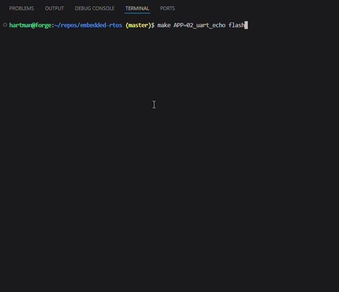

# 02_uart_echo

Polling USART2 transmit/receive bring-up for the Nucleo-F411RE.

This app configures USART2 on PA2/PA3 and verifies communication through the ST-LINK virtual COM port. It prints a startup message, then echoes each received byte back to the terminal.



## Verified

- Builds with `make APP=02_uart_echo`
- Flashes with `make APP=02_uart_echo flash`
- Prints startup message over USART2
- Echoes typed characters in `picocom`
- Handles carriage return by adding line feed for clean terminal output

## Run

Build and flash:

```bash
make APP=02_uart_echo
make APP=02_uart_echo flash
```

Open the serial terminal:

```bash
picocom -b 115200 /dev/ttyACM0
```

Expected startup output:

```text
UART echo ready
```

Type characters in the terminal. Each keypress should be echoed back by the MCU.

Exit `picocom`:

```text
Ctrl-A, then Ctrl-X
```

## Hardware Notes

- Board: Nucleo-F411RE
- MCU: STM32F411RE
- UART: USART2
- TX: PA2
- RX: PA3
- Alternate function: AF7
- Terminal settings: 115200 baud, 8N1, no flow control

## Implementation Notes

- Uses polling, not interrupts or DMA
- Polls `TXE` before writing transmit data
- Polls `RXNE` before reading received data
- Waits for `TC` after string transmission
- Assumes default `PCLK1 = 16 MHz`
- Uses `USART2_BRR = 0x008B` for 115200 baud
- Does not implement backspace/delete or line editing; those belong in a later command-shell app
